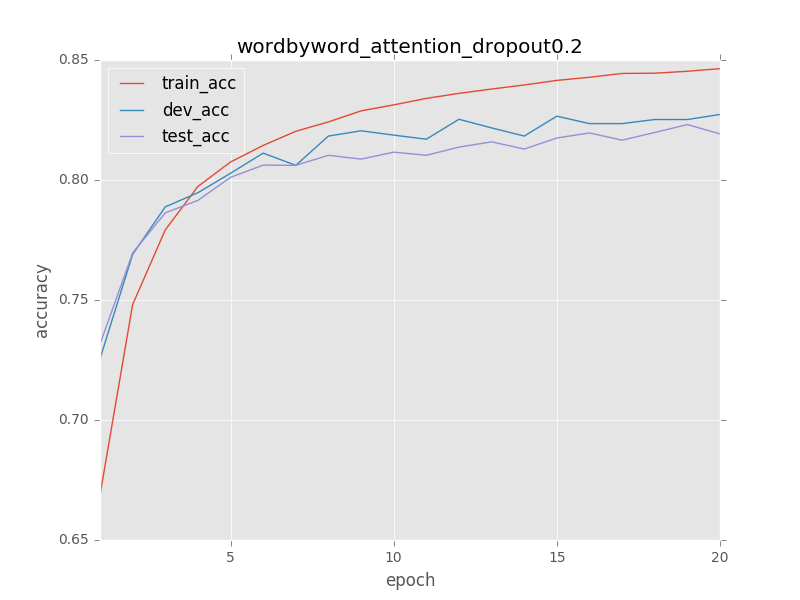
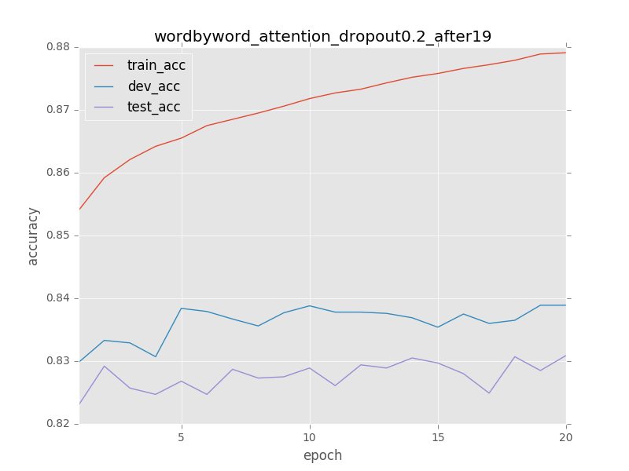
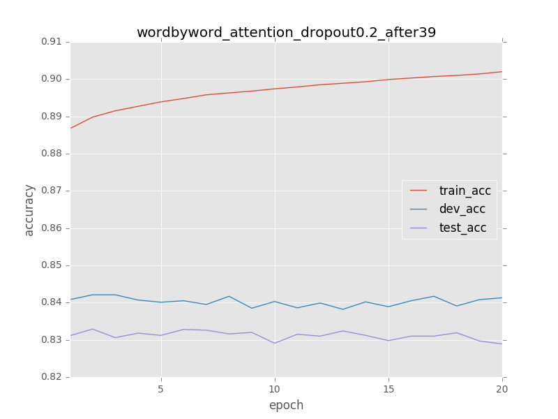

Attention on SNLI
===================
Unofficial implementation algorithms of attention models on SNLI dataset.

Current include papers:

1. "Reasoning About Entailment With Neural Attention", [arXiv:1509.06664][1]
2. "Learning Natural Language Inference with LSTM", [arXiv:1512.08849][2]

Based on Lasagne.

Requirements
===========
* Cuda 8(Theano can run with)
* Python 3
* Lasagne
* some others(best install Anaconda)

Run
===
At source root dir

First extracts preprocessed SNLI data
`./extract_data.sh`

Then run:
`python3 ./snli_reasoning_attention.py [condition|attention|word_by_word]`

Or run:
`python3 ./snli_match_lstm.py`

Results
======

The learning curve of word by word attention(best test acc is at epoch 41):

Epoch: 1-20

Epoch: 20-39

Epoch: 40-59

The learning curve of match LSTM with word embedding:

Notes
=====
About word by word attention:

1. The test acc of word by word attention is 0.2% smaller than the original paper, 83.29% (41 epochs)
2. every 20 epochs, we reduce learning_rate, see log files for detail info.

About match LSTM:

1. The test acc of match LSTM is 1% smaller than the original paper.
2. not decay learning rate when train
3. using Word2Vec pre-trained model
4. tune OOV words in train dataset, like in `Reasoning Attention`

[1]: http://arxiv.org/abs/1509.06664
[2]: http://arxiv.org/abs/1512.08849
[3]: 
